# jnj-ooc-dashboard
## Overview

The J&J OOC Dashboard is an all-purpose data visualization tool built to provide insight into J&J CEO Alex Gorsky and his contemporaries. It is powered by Plotly Dash, Google BigQuery, and a litany of other python libraries.

## Data Streams and How to Update

There are several data streams with their own sources and update processes to be accounted for. We will go over each of the core components of the dashboard and how to update the data behind them.

### Key Alex Gorsky Perception Metrics
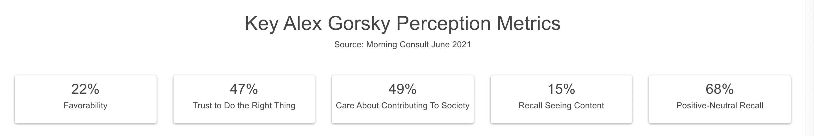

The data points are taken from reports sent by Morning Consult and are single value numbers placed directly into the code. Use decimal format as they will automatically be converted into percentages in the dashboard itself:

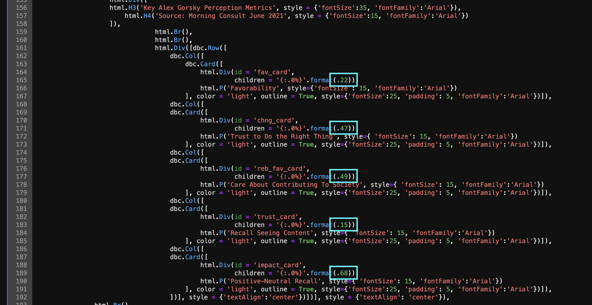

The numbers in the blue are what need to be updated with the following corresponding questions from Morning Consult's reports: 
  1. Favorability - Do you have a favorable or unfavorable impression of the following company executives?
  2. Trust to Do the Right Thing - To what extent do you agree that the following company executives can be trusted to do the right thing?
  3. Care About Contributing To Society - To what extent do you agree that the following company executives care about contributing positively to society?
  4. Recall Seeing Content - [percentage of respondents] of respondents said they have heard something about Alex Gorsky over the past two weeks...
  5. Positive-Neutral Recall - Almost one-in-four (22%) said they have a favorable impression of Johnson & Johnson CEO Alex Gorsky. Another 17% said they had no opinion, and almost half (46%) said they have never heard of him.

### Key Alex Gorsky Visibility Metrics
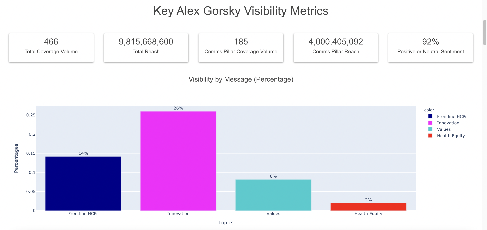

This data is taken from Talkwalker and is the most involved update process:
  1. Download all of the mentions from Talkwalker. This will take several attempts since there is a limit on how much can be exported from Talkwalker at once.
      1. Under "Topic Analytics" -> "Current Project: J&J", the appropriate topics will be under the "OOC" prefixed sections.
      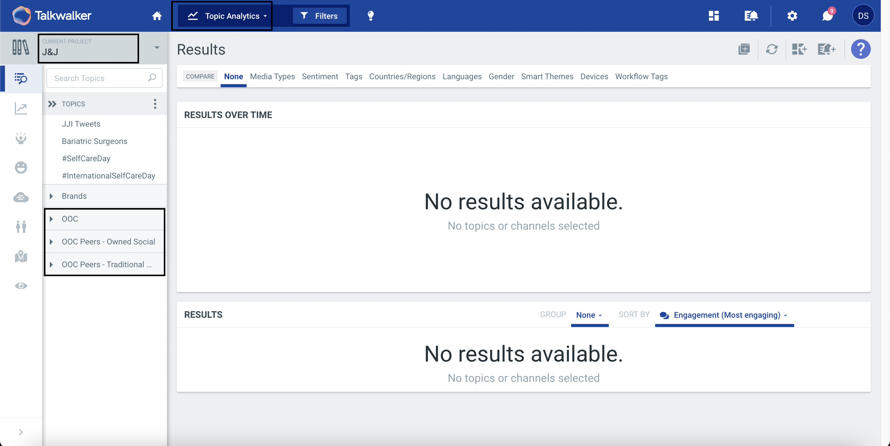
      2. Select the appropriate date from the filter. Again, this may take a few attempts to download all of the data, so do not expect to be able to export thye total monthly data for each topic at once.
      3. Click on the triple vertical dots on the top line of the results section and select "Export all results".
      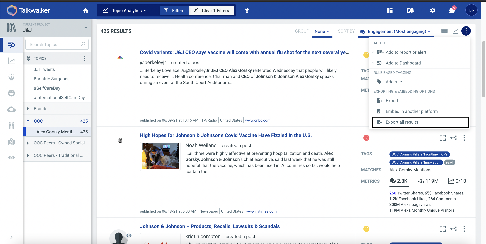
  2. Concatenate, clean, and convert the data to JSON.
      1. After downloading the data, concatenate it all into one large file.
      2. Remove excess columns from the data (mimic the sheet titled "Columns_to_Keep.xlsx" in the "data" folder).
      3. Load the data into a Pandas dataframe in Python.
      4. Run the following lines of code to clean the data a bit:
         ```
          for i, j in zip(df['matched_profile'], df.index):
            if 'Sundar Pichai' in i:
              df.loc[j, 'matched_profile'] = i.replace('Sundar Pichai', 'Sundar Pichai (Alphabet)')
          for i, j in zip(df['matched_profile'], df.index):
            if 'Sundar Pichai (Alphabet) (Alphabet)' in i:
              df.loc[j ,'matched_profile'] = i.replace('Sundar Pichai (Alphabet) (Alphabet)', 'Sundar Pichai (Alphabet)')
          for i, j in zip(df['matched_profile'], df.index):
            if 'Alex Gorsky Mentions' in i:
              df.loc[j ,'matched_profile'] = i.replace('Alex Gorsky Mentions', 'Alex Gorsky (J&J)')
         ```
      5. Run the following lines of code to create a JSON .txt file titled, "json_to_upload.txt":
         ```
          f = open('json_to_upload.txt', 'w')
          for row in df.iterrows():
              row[1].to_json(f)
              f.write('\n')
          f.close()
         ```
  3. Upload the data to BigQuery.
      1. Go to console.cloud.google.com
      2. Click on the triple horizontal lines in the top left to open the Cloud Console menu. Scroll down to the "Big Data" section and click on "Big Query".
         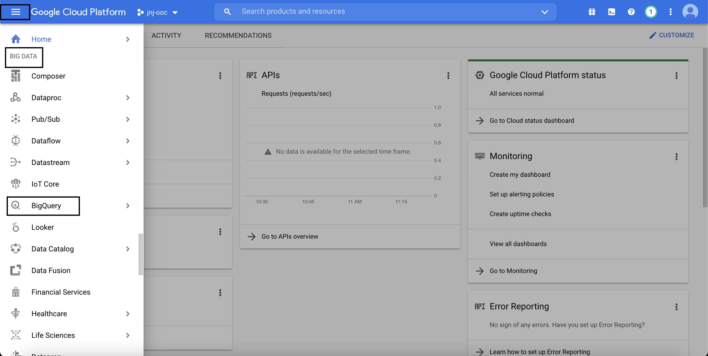
      3. Open the "jnj-ooc" tree dropdown to reveal the "jnj_ooc_dashboard_data" dataset, click on the triple verticle dots to the right of it, and then click on the plus sign to "Create table".
         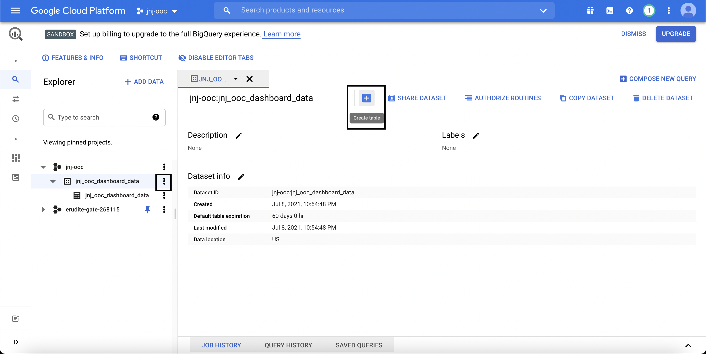
      4. Fill out the "Table name" box with "jnj_ooc_dashboard_data" and select "Upload" from the "Create table from:" dropdown.
         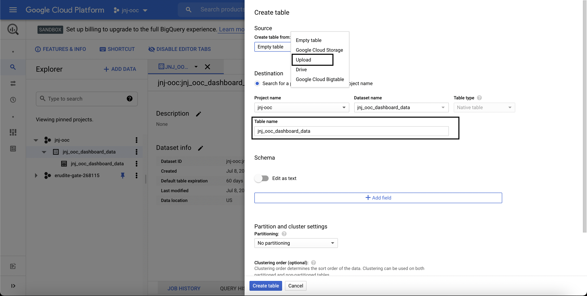
      5. Select the "json_to_upload.txt" file in the "Select file:' space, choose "JSONL (Newline delimited JSON)" from the "File format:" dropdown, and check the box for Auto detecting the schema and input parameters.
         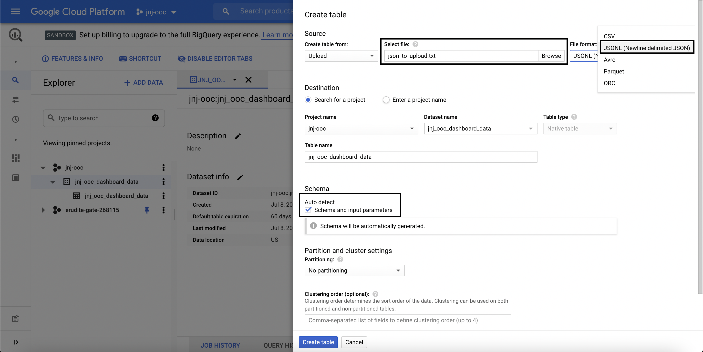
      6. Under the "Advanced options" tree dropdown, select "Append to table" from the "Write preference:" dropdown.
         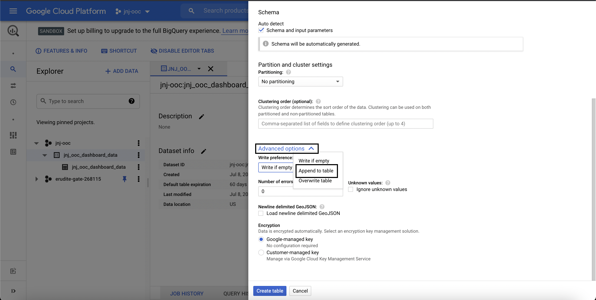
      7. Click on "Create table".

### Alex Gorsky Engagements
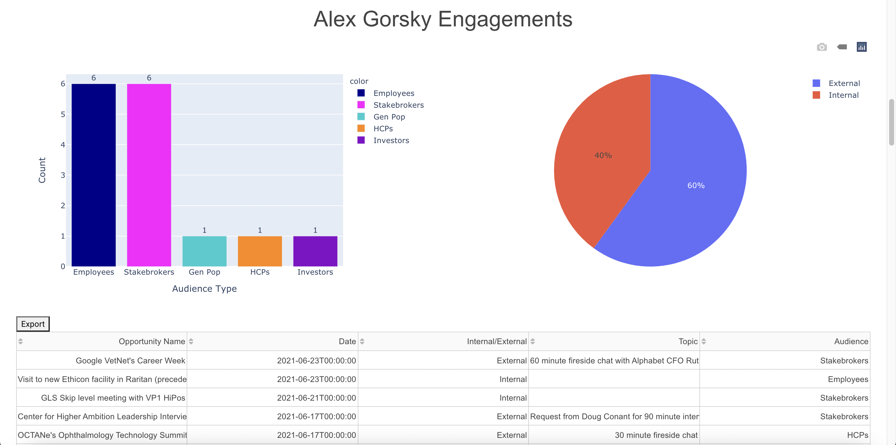

Data updates are sent by Sarah at J&J and should go into the Excel file titled "alex_activity_may". Key things for this update:
  1. "Audience" column is user defined. Work with James and Taylor Hiden on aligning.
  2. Make sure to have a "1" in the "Count" column for all fields.

### LinkedIn Performance
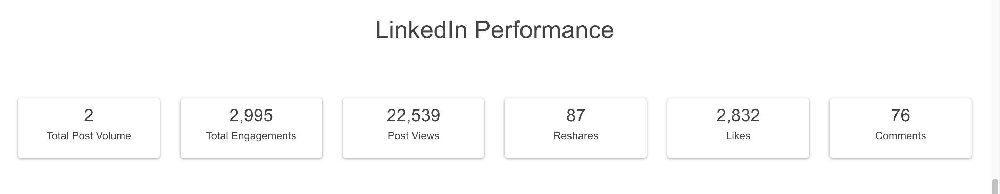

Data updates are sent by Sarah at J&J and should go into the Excel file titled "Alex Gorsky - LinkedIn".

### Blog Performance
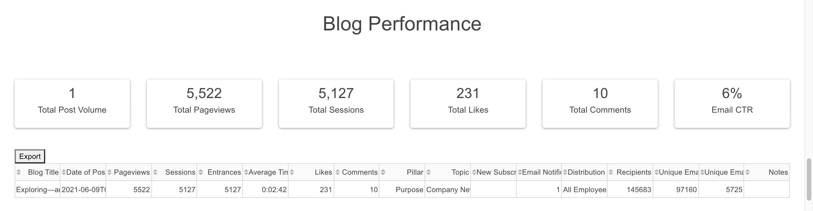

Data updates are sent by Sarah at J&J and should go into the Excel file titled "Alex Blog Data and Metrics".

### Most Read News Articles and Most Engaging Social Posts (both sets)
These are updated through BigQuery (See the "Key Alex Gorsky Visibility Metrics" section for details).

### Competitor and Peer CEO Landscape
These are updated through BigQuery (See the "Key Alex Gorsky Visibility Metrics" section for details).

### Visibility Over Time and Share of Visibility
These are updated through BigQuery (See the "Key Alex Gorsky Visibility Metrics" section for details).
